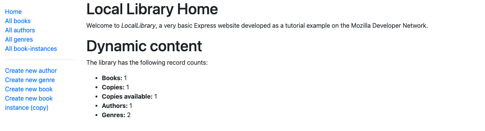

# express-locallibrary-tutorial

A library website with CRUD abilities for books, authors, genres, and copies of books. Created by going through Mozilla's [local library tutorial](https://developer.mozilla.org/en-US/docs/Learn/Server-side/Express_Nodejs/Tutorial_local_library_website).

    

## Features

- Uses Express, Node.js, Mongoose, and MongoDB.

## Demo / Installation

1.  Clone this repo.
2.  Run the following commands in your terminal, within the folder that was downloaded.

        npm i
        npm start

3.  Go to http://localhost:3000 in your browser
